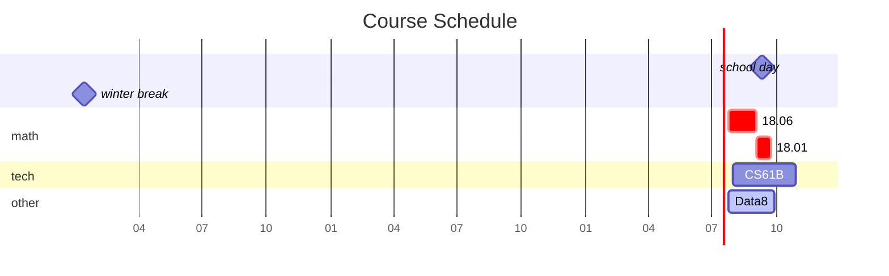

---
# the default layout is 'page'
icon: fas fa-info-circle
order: 4

mermaid: true
---
## About Me
I am a sophomore at SHNU whose name and major shall remain unknown.\
\
Since I finished my crash course on CS--CS61A at the end of July 2023, I've been self-learning open courses on CS, DS math and stats, and trying to forge my way through computer science.\
Below is a diagram of my schedule.
