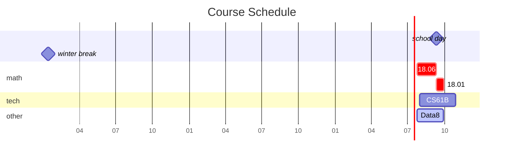

---
# the default layout is 'page'
icon: fa-solid fa-circle-user
order: 4

mermaid: true
---
I am a sophomore at SHNU whose name and major shall remain unknown. Since I finished my crash course on CS -- CS61A in July 2023, I've been self-learning open courses on CS, DS and math.

Below is a diagram of my schedule. (This may not be rendered on phones)

